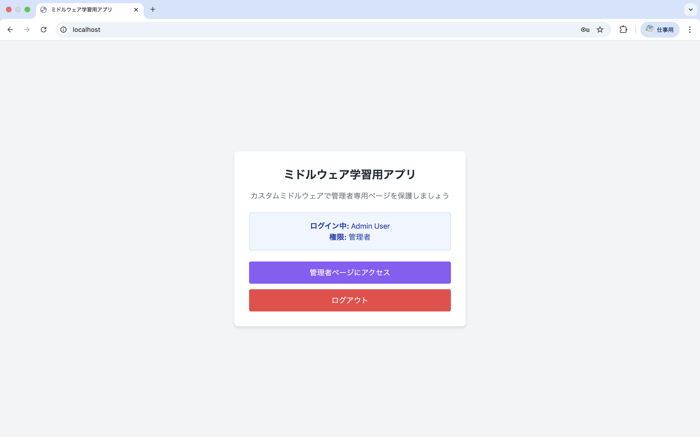
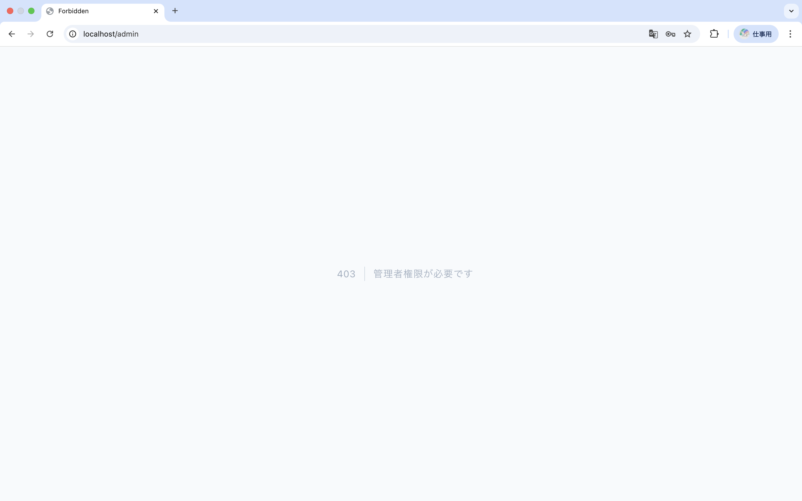

# middleware-app-practice

## 概要
COACHTECH 教材 Tutorial 10-2「ミドルウェア ハンズオン演習」で作成した成果物です。
ミドルウェア学習用アプリ。管理者と一般ユーザーを登録しておき、管理者のみ管理者ページへアクセスできるように設定。

## 使用技術
- PHP 8.x
- Laravel 10.x
- カスタムミドルウェア
- Laravel Fortify（認証）


## 学んだこと
- sail artisan make:middlewareでミドルウェアを作成し、ミドルウェアを記述する。
- Kernelへのミドルウェアの登録方法。
- Routeに複数のミドルウェアを設定する方法。

## 動作確認

- リポジトリをcloneし、プロジェクトディレクトリへ移動します。

```bash
git clone <リポジトリURL>
cd middleware-app-practice
```

- `.env` ファイルを作成します。

```bash
cp .env.example .env
```

- Docker（Sail）でMySQLへ接続できるように、`.env` のDB接続設定を確認します。

```env
DB_CONNECTION=mysql
DB_HOST=mysql
DB_PORT=3306
DB_DATABASE=laravel
DB_USERNAME=root
DB_PASSWORD=
```

- Composerの依存関係をインストールします。

```bash
composer install
```

- Dockerコンテナを起動します。

```bash
./vendor/bin/sail up -d
```

- アプリケーションキーを作成します。

```bash
./vendor/bin/sail artisan key:generate
```

- マイグレーションとSeederを実行し、管理者ユーザーと一般ユーザーを作成します。

```bash
./vendor/bin/sail artisan migrate:fresh --seed
```

- ブラウザで以下のURLにアクセスします。

```text
http://localhost/login
```

- 以下のテストアカウントでログインします。

| 種別 | メールアドレス | パスワード | 期待する動作 |
| --- | --- | --- | --- |
| 管理者 | admin@example.com | password | ログイン後、管理者ページに遷移する |
| 一般ユーザー | user@example.com | password | ログイン後、トップページに遷移する |

- 以下の動作を確認します。
  - 管理者ユーザーでログインすると、`http://localhost/admin` が表示される。
  - 一般ユーザーで `http://localhost/admin` にアクセスすると、403エラーが表示される。
  - 未ログイン状態で `http://localhost/admin` にアクセスすると、ログイン画面にリダイレクトされる。
  - 管理者ページからログアウトできる。

- 動作確認後、コンテナを停止します。

```bash
./vendor/bin/sail down
```

## 詰まったポイントと解決方法
- RoutingでのMiddlewareの登録方法
  ```
  middleware(['auth', 'checkAdmin'])
  ```
  Middlewareは配列で複数を登録することが可能。


## 開発の工夫
- 教材の内容に加え複数のmiddlewareを登録。
- 今回はmiddleware内でis_adminを真偽値として扱っているためModelでキャストし値の型を指定。

## 動作確認のスクリーンショット


